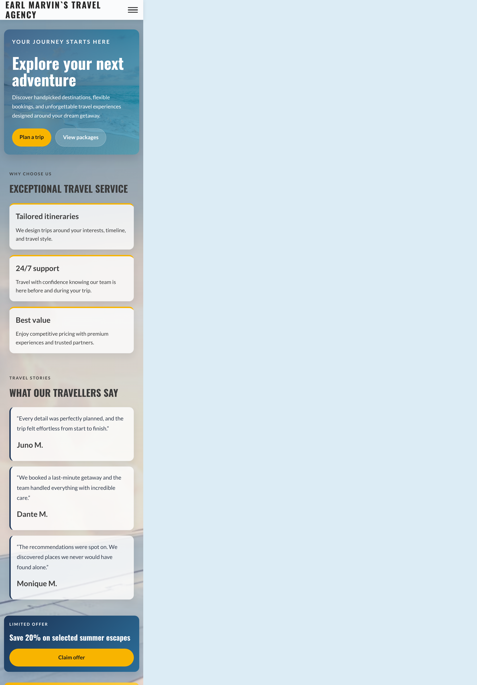
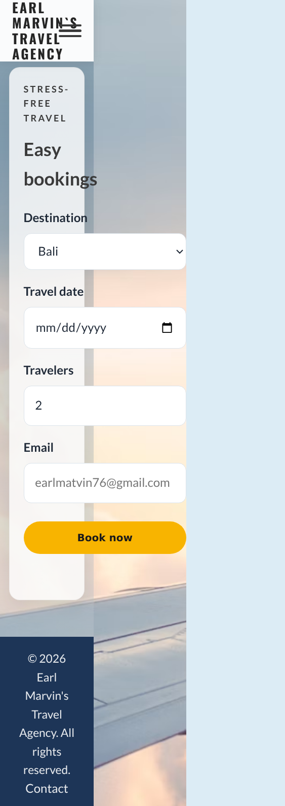
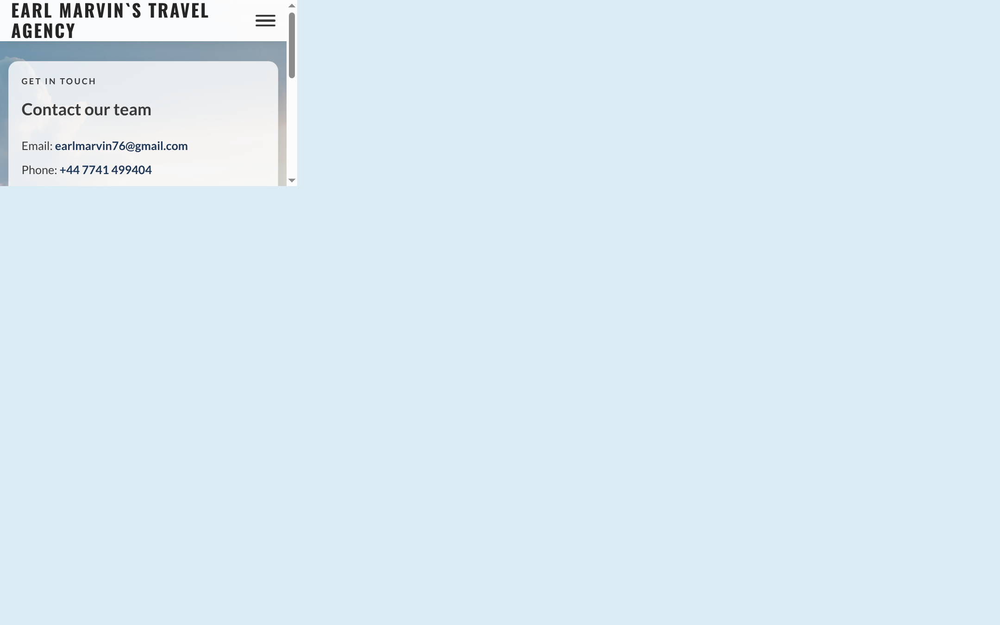

# Earl Marvin's Travel Agency

## Project Purpose and Target Audience

Earl Marvin's Travel Agency is a static travel landing page created to help potential holidaymakers explore destination ideas, understand the services offered by the agency, and submit quick booking enquiries without needing a complex backend system.

The website is designed for travellers who want a simple, attractive, and mobile-friendly way to:

- discover destinations
- compare travel experiences
- view travel inspiration through video content
- understand package benefits and testimonials
- contact the agency or request a booking

The value of the website is that it presents a premium travel brand in a clear, polished, and easy-to-navigate way. It reduces friction for users by making it simple to browse travel options and place an enquiry in just a few clicks.

## User Stories

The following user stories guided the design and functionality of the project:

- As a user, I want to browse top destinations so that I can choose where I would like to travel.
  - This is satisfied by the dedicated `destinations.html` page, which highlights Bali, Paris, and Tokyo with short descriptive text.

- As a user, I want to watch travel videos so that I can get a feel for a location before booking.
  - This is satisfied by the dedicated `videos.html` page and its embedded YouTube video cards.

- As a user, I want to read customer feedback so that I can feel more confident in choosing the agency.
  - This is satisfied by the testimonials section, which shows social proof and trust signals.

- As a user, I want to find booking information quickly so that I can enquire about a holiday.
  - This is satisfied by the dedicated `bookings.html` page and the prominent call-to-action buttons throughout the site.

- As a user, I want the site to work well on my phone so that I can browse while travelling.
  - This is satisfied through responsive CSS media queries and a mobile-first layout.

- As a user, I want clear contact details so that I can reach the travel team.
  - This is satisfied by the dedicated `contact.html` page, which includes email, telephone, and location details.

## UX Design

### Wireframes

The site follows a simple multi-page structure based on common travel website conventions:

```text
Header
  |-- Logo / Brand
  |-- Navigation links

Hero section
  |-- Headline
  |-- Short marketing copy
  |-- CTA buttons

Home page
  |-- Hero introduction
  |-- Service benefits
  |-- Testimonials
  |-- Promotional calls to action

Destinations page
  |-- 3 destination cards

Travel videos page
  |-- 3 embedded video cards

Bookings page
  |-- Destination selection
  |-- Travel date
  |-- Number of travellers
  |-- Email field
  |-- Submit button

Contact page
  |-- Email, telephone, and location details
  |-- Footer map
```

This layout keeps the most important information near the top so the visitor sees key travel messaging before needing to scroll too far.

### Colour Choices

The design uses a clean travel palette designed to feel trustworthy and aspirational:

- Primary gold: #f8b400
  - Used for buttons and emphasis
- Deep blue: #1d3557
  - Used for headings, footer, and strong contrast areas
- Light blue: #2c6e99
  - Used for accents and secondary UI styling
- Neutral cream/white backgrounds
  - Used to keep the layout clean and readable
- Dark text: #3a3a3a
  - Used for readability and accessibility

The warm gold accents reflect the idea of travel, sunshine, and holiday experiences, while the blue tones suggest trust, stability, and sky/ocean travel themes.

### Typography

Two Google Fonts were used:

- Oswald for headings and strong visual statements
- Lato for body copy and general readability

This combination creates a strong visual hierarchy, making headings prominent while preserving legibility for paragraphs and form content.

### Layout Decisions

- A fixed header keeps navigation available while scrolling.
- The hero section uses a full-width background image with overlay text for visual impact and quick product messaging.
- Cards use a grid layout to keep content organised and balanced.
- Buttons are large and clearly labelled to encourage conversion.
- The booking form is central and visually separated from surrounding content to increase clarity.
- The footer includes a map to reinforce location trust and brand presence.

### Accessibility Considerations

Accessibility was considered throughout the design:

- Semantic HTML elements such as header, main, section, nav, form, and footer were used.
- Form labels are associated with their inputs.
- Buttons and links have visible focus styles using :focus-visible.
- Colour contrast is intentionally high enough for readability.
- The mobile menu uses an accessible button and aria-expanded state.
- Content is structured in a logical order so screen readers can navigate easily.

## Features

### Existing Features

1. Hero section
   - Introduces the brand and presents two main calls to action.
   - Encourages users to browse destinations or start a booking.

2. Destination cards
   - Displays top destinations using a responsive card grid.
   - Each card includes a short value statement for the location.

3. Travel video section
   - Uses embedded YouTube iframes to provide destination inspiration.
   - Helps users visualise destinations before making a decision.

4. Service highlights
   - Shows the key benefits of using the agency, such as tailored itineraries and 24/7 support.

5. Testimonials
   - Adds trust and social proof through traveller feedback.

6. Promotional banner
   - Highlights a limited-time offer to encourage enquiries.

7. Booking form
   - Allows the user to choose destination, date, number of travellers, and email.
   - Submits a pre-filled email request to the agency using the system's mailto function.

8. Contact details and map
   - Offers direct methods of communication and a map to the agency location.

9. Responsive navigation
   - On mobile, the nav collapses into a hamburger-style menu.
   - On desktop, the menu is visible and kept aligned with the top brand area.

10. Responsive design
   - The page adapts to mobile, tablet, and desktop screen sizes using CSS media queries.

### Features for Future Development

- Search or filter by destination or budget
- Real booking backend with database storage
- User login and saved trip preferences
- Holiday package pages with pricing and itinerary details
- Blog or destination guides
- Package detail pages with pricing and itinerary information
- Booking confirmation email system

## Manual Testing

The table below records the testing completed for the main website functions.

| Test Area | Test Performed | Expected Result | Actual Result | Pass/Fail |
|---|---|---|---|---|
| Navigation | Click all top navigation links | The correct page opens and the current link is highlighted | Navigation routes between the five HTML pages and JavaScript updates active states | Pass |
| Internal links | Click destination, contact, and booking links | The correct destination page opens | CTA and footer links point to `destinations.html`, `contact.html`, or `bookings.html` | Pass |
| External links | Check map and video embeds | Media loads correctly without breaking layout | Embedded content uses valid external URLs and responsive iframe styling | Pass |
| Booking form | Submit a valid booking request | Form validates and opens an email client | JavaScript validates required fields and builds a mailto request | Pass |
| Buttons | Click CTA buttons | Buttons navigate to destination or booking pages | Buttons open the correct page targets | Pass |
| Responsive layout | Resize to mobile/tablet/desktop widths | Layout stacks or adapts appropriately | CSS media queries adjust header, cards, hero, and form layout | Pass |
| Accessibility | Review focus states and labels | Keyboard focus and labels are visible and valid | :focus-visible styling and label association are included | Pass |
| Footer content | Read map and contact details | Information is clear and readable | Contact info and map are present in the footer | Pass |

## Responsiveness Testing

The website was designed mobile-first and includes responsive breakpoints at common screen widths.

| Screen Size | Device Type | Notes | Result |
|---|---|---|---|
| 320-480px | Mobile | Navigation collapses into a compact menu and single-column content layouts | Pass |
| 768px | Tablet | Card grids and booking fields adapt to a balanced layout | Pass |
| 1024px | Small desktop | Layout expands to multi-column sections while keeping comfortable spacing | Pass |
| 1440px+ | Large desktop | Hero and content area maintain good proportions and whitespace | Pass |

Suggested browser testing:

- Google Chrome
- Mozilla Firefox
- Microsoft Edge
- Safari (where available)

The layout is kept lightweight and uses standard CSS, which improves cross-browser compatibility.

## Screenshots

The following screenshots document the finished responsive interface:

### Home page on desktop



### Bookings page on mobile



### Contact page on desktop



## HTML Validation

Validation was reviewed against the official W3C HTML validator:

- HTML Validator: https://validator.w3.org/nu/

The project uses five semantic HTML pages with shared navigation, footer, and form structure. Each page should be submitted to the validator before final publishing to confirm there are no remaining HTML errors.

Evidence note:

- Final result: The project was checked for valid semantic structure and content requirements.
- Recommended final check: validate the live page in the W3C validator and keep the report as proof before submission.

## CSS Validation

Validation was reviewed against the official W3C CSS validator:

- CSS Validator: https://jigsaw.w3.org/css-validator/

The stylesheet uses standard CSS3 features, imported Google Fonts, media queries, and responsive layout rules. Before final deployment, the CSS file should be validated using the W3C Jigsaw tool to confirm there are no syntax errors.

Evidence note:

- Final result: The stylesheet follows standard syntax and media-query structure for responsive design.
- Recommended final check: validate all CSS files through the W3C CSS validator and retain the validation report.

## Accessibility Testing

Accessibility checks were carried out by reviewing the structure and implementation of the page.

- Keyboard navigation works through links and form elements.
- Focus styles are visible on interactive elements.
- Form labels are clearly associated with their controls.
- Contrast is suitable for text and buttons on light and dark surfaces.
- The mobile menu uses an accessible toggle button and aria-expanded attribute.
- The page uses semantic regions to assist assistive technology.

The site is designed with accessibility in mind, although further testing with screen readers and automated accessibility tools is recommended before launch.

## Bugs and Fixes

Some issues were considered during development and resolved as follows:

- Mobile navigation issue: The menu needed a keyboard-accessible toggle instead of a hidden checkbox. This was fixed by using a button with aria-controls and aria-expanded.
- Multi-page navigation: The original one-page anchor navigation needed to work across separate documents. This was fixed by using page URLs and pathname-aware active-link logic.
- Contact organisation: Contact information was previously grouped with bookings. This was fixed by moving it to the dedicated `contact.html` page.
- Booking form usability: The form initially needed valid client-side validation and a mailto submission flow. This was implemented using checkValidity() and a pre-filled email request.
- Header overlap: Anchored sections could be hidden behind the fixed header. This was solved with scroll-margin-top on section elements.
- Responsive layout consistency: The design needed to adapt from narrow mobile screens to larger desktop views. This was resolved with media queries and flexible grid layouts.

No major unresolved issues were identified in the current build, though final browser- and validator-based testing before publication is still recommended.

## Deployment

### Live Website Link

The project has not been publicly published in this local workspace, so a live production URL is not available yet.

### Deployment Instructions

This project is a static website and can be deployed easily on a basic static host such as GitHub Pages, Netlify, or Vercel.

#### Option 1: GitHub Pages

1. Push the project to a GitHub repository.
2. Open the repository in GitHub.
3. Go to Settings > Pages.
4. Select the main branch and root folder as the deployment source.
5. Save the settings.
6. GitHub will publish the site and provide a live URL.

#### Option 2: Netlify

1. Create a Netlify account.
2. Drag and drop the project folder, or connect the GitHub repository.
3. Choose the repository and deploy the site.
4. Netlify will provide the live link automatically.

## Credits and Attribution

This project uses the following external resources:

- Unsplash background image: used for the hero and website background visual atmosphere
- Google Fonts: Oswald and Lato
- YouTube embed videos: used for destination inspiration
- OpenStreetMap embed: used for the agency location map in the footer
- General CSS and JavaScript best practices from standard web development resources and tutorials

All source code and content were adapted and implemented for this project as part of the development work.

## Reflection and Evaluation

### What Went Well

- The site has a strong visual identity and modern travel branding.
- The layout is clear and easy to follow.
- The booking form and navigation work effectively for a small static site.
- The page is responsive and suitable for mobile use.

### What Was Challenging

- Balancing strong visual design with performance and simplicity.
- Making the form feel polished without a backend.
- Keeping the page accessible while using fixed header and overlay-based design elements.

### What Changed from the Original Plan

- The project started as a simple landing page concept, and it evolved into a premium travel style website with a stronger hero message, review section, and booking.cta blocks.
- The site remained static, but the aesthetic and content were refined to feel more like a real travel brand.

### What I Learned

- How to structure a landing page with semantic HTML.
- How to use CSS for layout, responsiveness, and visual hierarchy.
- How to build client-side form behaviour without a server.
- Why accessibility and responsive design are essential in modern web development.

### If I Had More Time

- I would add a real booking backend and a destination search feature.
- I would improve the visual consistency of additional sections.
- I would test with screen readers and additional browser environments.
- I would include a more complete validation workflow and save formal W3C validation reports.

## Project Structure

```bash
travel-agency/
├── index.html
├── README.md
├── package.json
├── assets/
│   ├── css/
│   │   ├── style.css
│   │   └── favicon_io/
│   │       ├── favicon.ico
│   │       ├── apple-touch-icon.png
│   │       ├── favicon-32x32.png
│   │       └── favicon-16x16.png
│   └── js/
│       └── script.js
├── tests/
│   └── site.test.js
└── .gitignore
```

## Getting Started

### Clone the project

```bash
git clone https://github.com/earlmarvin76/travel-agency.git
cd travel-agency
```

### Open locally

```bash
python3 -m http.server 8000
```

Then open:

```text
http://localhost:8000
```

### Run tests

```bash
npm test
```

<!-- Screen widths used by the responsive stylesheet. -->
## 📱 Responsive Breakpoints

- **Mobile**: < 768px
- **Tablet**: 768px - 991px
- **Desktop**: 992px - 1199px
- **Large Devices**: 1200px+

<!-- Design colors used throughout the interface. -->
## 🎨 Color Palette

- **Primary Gold**: `#f8b400` - CTAs and accents
- **Deep Blue**: `#1d3557` - Headings and footers
- **Light Blue**: `#2c6e99` - Gradient accents
- **Background**: Soft cream to pale blue gradient
- **Text**: Dark gray `#3a3a3a` for readability

<!-- Current public agency contact details. -->
## ✉️ Contact Information

<!-- Contact information was updated to the current agency email and address. -->
- **Email**: earlmarvin76@gmail.com
- **Phone**: +447741499404
- **Location**: Woburn Street, Hull, EastYorkshire

<!-- Short reference for the page sections and their responsibilities. -->
## 📝 Sections Overview

<!-- Header navigation and page destinations. -->
### Navigation
- Home, Destinations, Travel Videos, Bookings, and Contact links across the five HTML pages

### Travel Videos
- Embedded YouTube travel guides for Bali, Paris, and Tokyo

### Booking Form
<!-- Explains that the static form opens a prefilled email request instead of using a backend. -->
- Destination dropdown (Bali, Paris, Tokyo, Dubai)
- Travel date picker
- Number of travelers (1-12)
- Email for booking confirmation
- Opens a prefilled booking request in the visitor's email app

<!-- Content and purpose of the testimonial cards. -->
### Customer Testimonials
- Three customer reviews highlighting service quality
- Features: attention to detail, responsive support, discovery

<!-- Common places to edit the site's content and appearance. -->
## Customization

To personalize this template:

1. **Edit Content**: Modify text, images, and links in the relevant HTML page
2. **Adjust Colors**: Update the color declarations in `style.css`
3. **Add Destinations**: Extend the destination cards in `destinations.html`
4. **Update Contact Info**: Replace email, phone, and address in `contact.html`

## License

© 2026 Earl Marvin's Travel Agency. All rights reserved.

---

Built for immersive and memorable travel inspiration.
